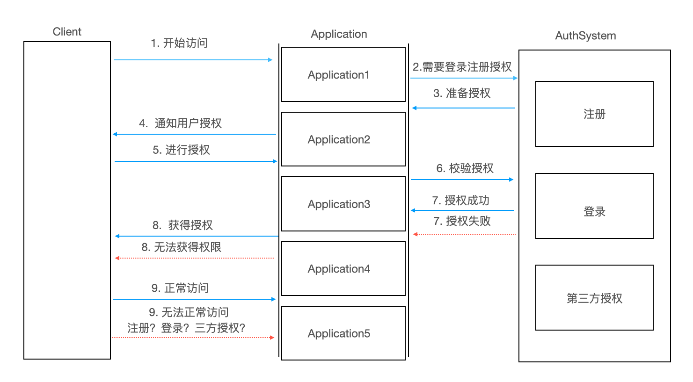
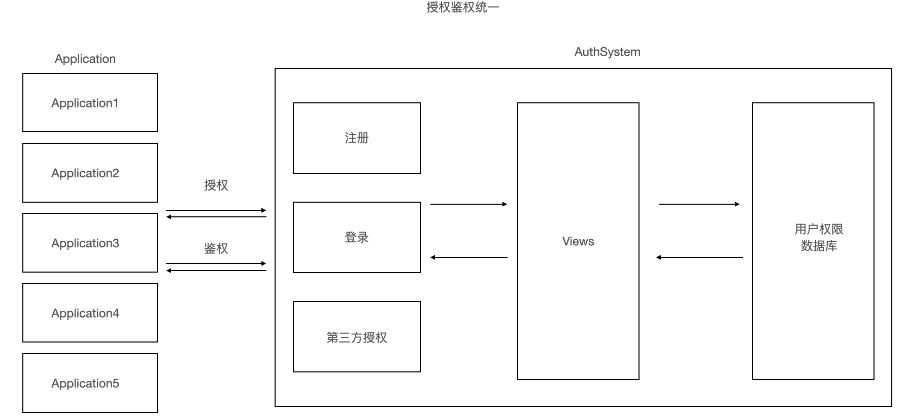
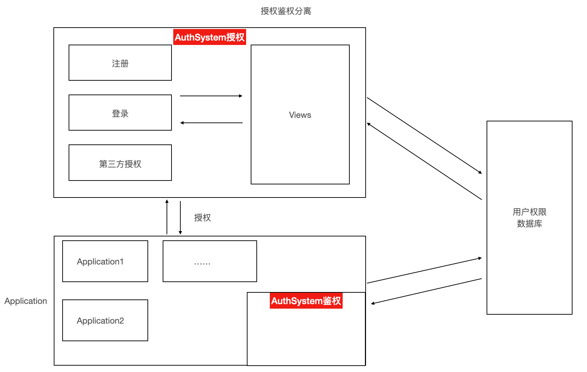

## 授权系统

### 一、介绍

本项目将会制作一个授权系统，其他application程序均可以使用本授权系统实现注册、登录认证以及第三方授权...

### 二、简易流程

### 三、系统架构

暂时不确定，这里预计出两个版本，分别如下：

1. 版本一 授权、鉴权统一在AuthSystem服务器上

   

2. 版本二 授权鉴权分离，授权在AuthSystem服务器上，鉴权在AuthSystem客户机上

   

**理由：**

目前来看是这样的情况：

版本一中的权限授权和鉴权都在服务端上，会出现如下问题：

- `AuthSystem`系统压力将会大一点。

版本二虽然会降低`AuthSystem`系统压力，但是会出现如下问题：
- 加密秘钥分散（由于application也都是''服务端''程序，非''客户端''程序，倒是不用太担心泄密，但是`AuthSystem`系统秘钥一旦更新，这些''服务端''程序秘钥都要调整）
- 数据库存在远程传输的问题

后面再考虑取舍吧....

### 四、版本迭代计划

确定后期开发过程中实现的重点目标，以此实现产品快速开发，暂定Python实现，后期考虑使用golang重构

1. 产品基本功能version 0.1 alpha
   - version 0.0.1使用django快速实现register
   - version 0.0.2使用django快速实现login
   - version 0.0.3 使用django快速实现第三方授权（微博[暂定]，....）
2. 产品开放授权鉴权version 0.2 alpha
   - version 0.1.1 使用jwt实现授权
   - version 0.1.2 使用jwt实现鉴权
3. 开放适用版本version 0.3 beta
   - 修复bug，退出适用版本

4. 性能优化 version 0.4 beta
5. 正式开放 version 0.5
6. ....